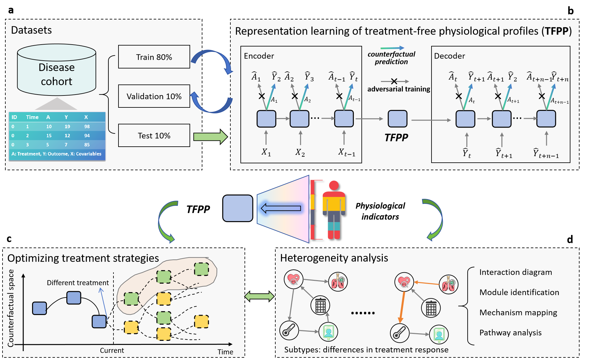

# Temporal Causal Precision Medication (TCPM)

A generalist framework for translating routine physiological indicators into personalized treatment strategies using temporal causal inference.

## Overview

TCPM (Temporal Causal Precision Medication) is a novel framework designed to address treatment response heterogeneity in clinical practice by leveraging temporal causal inference and treatment-free physiological profiles. This repository contains the implementation of the TCPM framework as described in our paper:

**A generalist precision medication framework using temporal causal inference based on treatment-free physiological profiles**  

TCPM integrates counterfactual prediction, adversarial learning, and optimal search algorithms to derive personalized longitudinal treatment strategies across various acute and chronic diseases.

## Key Features

- **Treatment-Free Physiological Profile (TFPP)**: A novel representation of heterogeneous physiological states that eliminates confounding bias through adversarial training
- **Counterfactual Prediction**: Accurate prediction of patient outcomes under alternative treatment strategies
- **A*-Powered Optimal Search**: Derives optimal longitudinal treatment sequences balancing immediate and long-term outcomes
- **Heterogeneity Analysis**: Identifies patient subgroups with divergent response patterns and reveals underlying physiological mechanisms
- **Broad Applicability**: Validated across 6 disease cohorts (sepsis, diabetes, hypertension, coronary heart disease, macular degeneration, pediatric burns)

## Framework Architecture

  
*Figure 1: Overview of the TCPM framework analysis workflow*

1. **Treatment-Free Physiological Profile Learning**: Encoder-decoder architecture with adversarial training to eliminate treatment confounding
2. **Treatment Strategy Optimization**: A*-based search algorithm to identify optimal personalized treatment sequences
3. **Subgroup Identification**: Stratifies patients into subgroups with distinct therapeutic response patterns
4. **Physiological Network Analysis**: Constructs correlation and causal graphs to reveal mechanistic differences between subgroups

## Installation

```bash
# Clone the repository
git clone https://github.com/zizhendeng/Precision-Medication.git
cd Precision-Medication

# Use conda to create a new environment according to environment.yaml
conda env create -f environment.yaml
```

## Usage
The framework supports multiple disease cohorts. Example data loaders for public datasets (MIMIC-III derived) and private datasets are provided in `LoadData.py`. The main training and treatment strategy optimization is in `test.py`


### Data Preparation

```python
csv_data, headers = LoadData.load('./data/disease_data.csv')

# Initialize data loader
encoder_data = LoadData.getEncoderData(csv_data, headers,
                                        LoadData.getMaxSequenceLength(csv_data),
                                        LoadData.getMaxTreatmentNumber(csv_data, headers))
```

### Model Training

```python

en_lit_crn = LitCRN(params, best_hyperparams, False, learning_rate=0.01)
en_trainer = L.Trainer(max_epochs=30, deterministic=True, devices=devices)

de_lit_model = LitCRN(params, best_hyperparams, True, 0.01)
de_trainer = L.Trainer(max_epochs=30,  deterministic=True, devices=devices)

```


### Optimal Treatment Search

```python

# Find optimal treatment sequence
 results = SearchApp.getResult(predictor, en_lit_crn, L.Trainer(logger=False, deterministic=True,  devices=devices), de_lit_model,
                                    [csv_data[index]], headers, num_treatments, horizons,
                                    best_hyperparams['rnn_hidden_units'],
                                    lip_const_K, 1.0, baseline_steps, 10)
```


## Results

TCPM outperformed standard clinical protocols and state-of-the-art reinforcement learning methods across multiple metrics:

- Superior therapeutic efficacy across 6 disease cohorts
- Accurate counterfactual predictions (PCC=0.73-0.86 across cohorts)
- Clinically meaningful patient subgroup stratification
- Mechanistic insights through physiological network analysis

Detailed results can be found in our paper and supplementary materials.

## Directory Structure

```
Precision-Medication/
├── README.md
│   
├── SearchAdapter.py
│   └── Implements the treatment strategy optimization function based on the A* search algorithm, and defines classes such as CRNState, CRNTreatment, CRNConvertor, and CRNRestEstimator.
├── SearchApp.py
│   └── Contains auxiliary functions such as obtaining the initial state, L value, reward function, etc., and calls the getResult function in SearchAdapter to search
├── CRN_Lightning_model.py
│   └── Use LightningModule and LightningDataModule to encapsulate the training, validation, testing, and prediction steps of the CRN model.
├── CRN_model.py
│   └── Define the structure of the CRN model
├── LoadData.py
│   └── Provides data loading, processing and conversion functions, including loading data from CSV files, obtaining the maximum sequence length, obtaining encoder and decoder data, etc.
├── LipDecoder.py
│   └── Defining a decoder with Lipschitz constraints
├── AStarSearch.py
│   └── Implements the core logic of the A* search algorithm, including classes such as state, treatment, converter, residual reward estimator, and searcher
├── test.py
│   └── Test script, including setting random seeds, loading data, training encoder and decoder models, and calling SearchApp for search
├── compute_effects.py
│   └── Used to calculate causal effects at the individual level
├── utils/
│   ├── evaluation_utils.py
│   │   └── Contains data processing and formatting functions for preparing data for training encoders and seq2seq architectures
```
## Acknowledgments

This project referenced and borrowed from the following resources during the development process, and we would like to express our gratitude here.

- **Model Architecture**：
  - [Estimating counterfactual treatment outcomes over time through adversarially balanced representations](https://openreview.net/forum?id=BJg866NFvB)
  - [Counterfactual-Recurrent-Network](https://github.com/ioanabica/Counterfactual-Recurrent-Network.git)  
  - *I. Bica, A. M. Alaa, J. Jordon, M. van der Schaar*  
    Our model design is partly inspired by the CRN framework proposed in the paper, which extracts temporal ubiased representations. On this basis, we optimize the model by adding Lipschitz continuity constraints, multi-outcome counterfactual predictions, and optimization search.
    
- **Datasets**：
  - [MIMIC-III Clinical Database](https://github.com/MIT-LCP/mimic-code.git)  
   This study used the MIMIC-III dataset for model training and validation. We would like to thank MIT Lab for providing public medical data resources.

- **Data processing**：
  - [Sepsis Cohort from MIMIC III](https://github.com/microsoft/mimic_sepsis.git)
  - [The Artificial Intelligence Clinician learns optimal treatment strategies for sepsis in intensive care](https://www.nature.com/articles/s41591-018-0213-5)
  - *Komorowski M, Celi L A, Badawi O, et al*
   For the data in MIMIC, the missing values ​​of physiological indicators and the processing of discrete time series, we mainly refer to this paper and the corresponding project.

    
## Citation

If you use this framework in your research, please cite our paper:

```bibtex
@article{tcpmpaper,
    title={A generalist precision medication framework using temporal causal inference based on treatment-free physiological profiles},
    author={Deng, Zizhen and Wu, Wei and Zhang, Chi and Zhao, Xitong and Pu, Minghao and Bu, Yanbin and Liao, Yanfeng and Wang, Changguan and Yang, Jiarui and Wang, Yanni and Wang, Jinzhuo},
    year={2025}
}
```

## Contact

For questions or issues, please contact:
- Jinzhuo Wang: wangjinzhuo@pku.edu.cn
  
## License

This project is licensed under the MIT License - see the LICENSE file for details.
